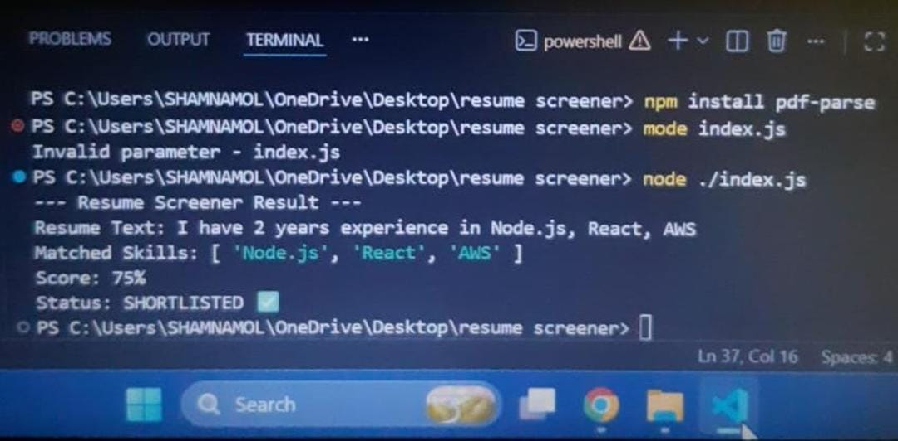

# Automated-resume-screener

A Node.js project that screens resumes based on skills.

## Output Screenshot

## Terminal Result
- Resume Text: I have 2 years experience in Node.js, React, AWS
- Matched Skills: [ 'Node.js', 'React', 'AWS' ]
- Score: 75%
- Status: SHORTLISTED ✅

## How to Run
npm install pdf-parse
node ./index.js
